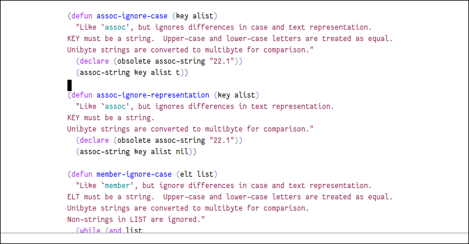

# center-layout

Provides a global minor mode `center-layout-mode` for centering
windows by applying left and right margins.



## Installation

Clone the stable branch:

```shell
git clone -b stable https://gitlab.com/lae/emacs-center-layout.git
```

Add to your Emacs init file:

```elisp
(add-to-list 'load-path "<path-to-cloned-directory>")
(require 'center-layout)
(center-layout-mode)
```

## Customization

Customizations can be done via: <kbd>M-x</kbd> `customize-group`
<kbd>return</kbd> `center-layout` <kbd>return</kbd>.

 * `center-layout-columns`: Default `80`. Width of centered content.
 * `center-layout-apply-right-margin`: Default `nil`. If `t` right margin will
   be applied also. If `nil` no right margin will be applied, allowing longer
   lines to flow to the right exceeding `center-layout-columns`.

These customization options become buffer-local whenever they are set, for
example, to set mode specific customization for `emacs-lisp-mode`:

```lisp
(add-hook
 'emacs-lisp-mode-hook
 (lambda ()
   (setq center-layout-apply-right-margin t)
   (setq center-layout-columns 100)))
```
